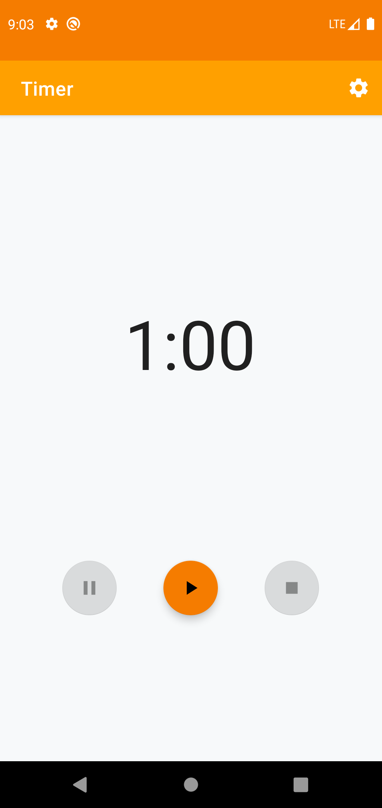
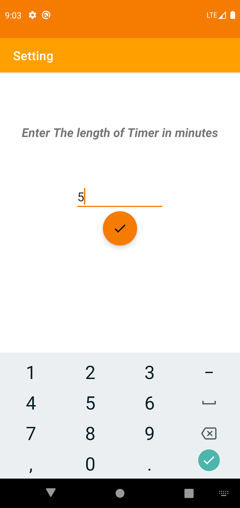
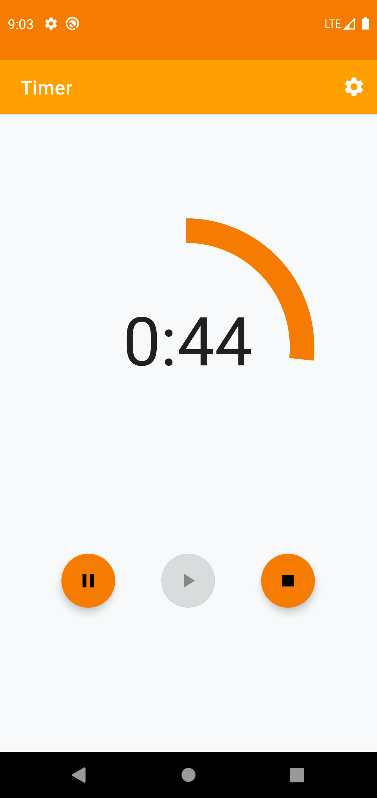
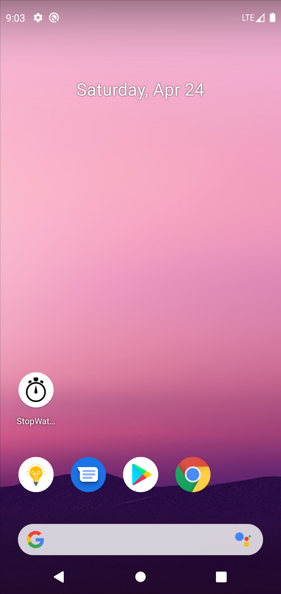
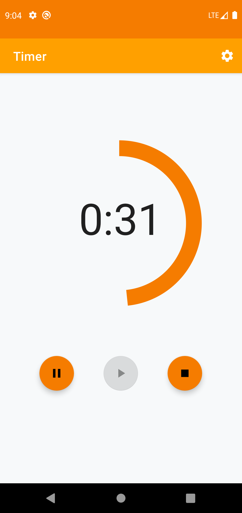
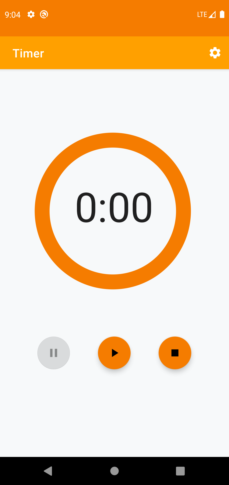

# CountDownTimer
# Check out Master Branch to see the project.

This is a basic timer app in which the user can set up the timer length of his/her choice.

Key Features used :
1. Shared preferences - the application gives a good practice of shared preferences to the developer.
2. Material progressbar (  implementation 'me.zhanghai.android.materialprogressbar:library:1.6.1' )
3. Dynamic floating action buttons.
4. Background working.
 
  -> On start :
      
  -> we can set the time length :
      
  -> Material progressbar :
      ->Also the timer is active in background also
      
      
      
  -> On Completion :
      
